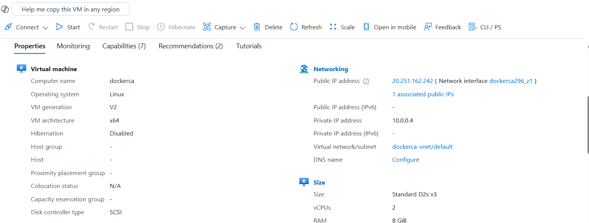
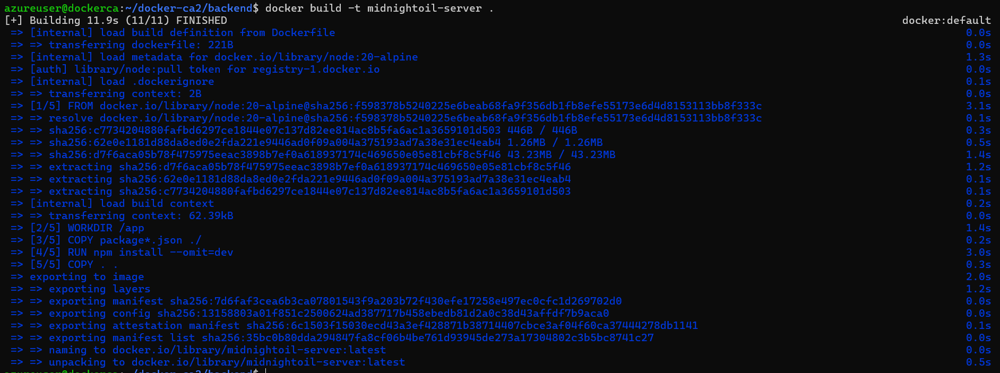
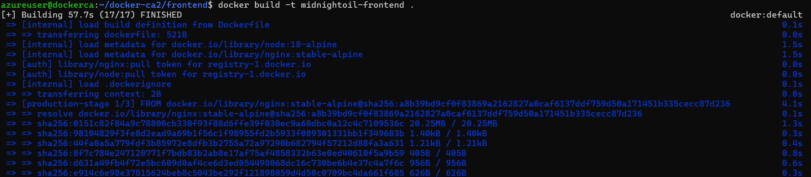
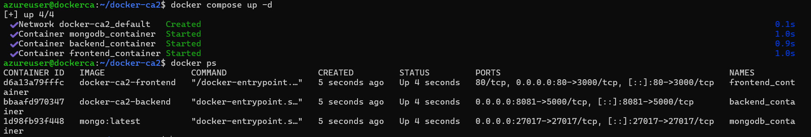

# Project Report 

## 1. Introduction

This project involved designing a private cloud environment and deploying a containerised full-stack web application within that environment. The application in this repository (Midnight Oil) is a three-tier food ordering platform composed of a React frontend, a Node.js/Express backend, and a MongoDB database. The solution was packaged using Docker and orchestrated with Docker Compose to support consistent deployment across development and hosting environments.

This report documents the private cloud plan and design, summarises the implementation process, explains the containerisation strategy, and reflects on the overall outcome of the project. It also identifies the contribution made by each group member and lists the supporting artefacts submitted with the final work.

## 2. Scenario and Objectives

The scenario for this assignment required the developer to design and implement a private cloud solution capable of hosting a containerised application. In response, I selected a web-based restaurant platform that allows users to browse menus and products and submit contact messages. The application was split into separate frontend, backend, and database services to follow a modular architecture suitable for cloud deployment.

The project objectives were as follows:

1. Design a private cloud environment that can host the application reliably.
2. Identify infrastructure, networking, storage, and security requirements.
3. Justify the technologies selected for both the cloud platform and the application stack.
4. Containerise the application components using Docker.
5. Deploy the containerised application in the target environment.
6. Validate that the services communicate correctly and are accessible to users.

## 3. Private Cloud Plan and Design

### 3.1 Requirements Analysis

The solution required an environment capable of hosting three connected services:

1. A frontend web service for user interaction.
2. A backend API service for application logic and data access.
3. A MongoDB database service for persistent storage.

From an infrastructure perspective, the environment needed to provide the following:

1. One virtual machine or node capable of running Docker.
2. Network connectivity between containers and external users.
3. Persistent storage for MongoDB data.
4. Basic security controls for access to the application and management interfaces.
5. Sufficient CPU, RAM, and storage resources to support the application workload.

Functional requirements included:

1. Displaying menu and product data to users.
2. Accepting contact messages from the frontend and storing them in MongoDB.
3. Serving the frontend over HTTP and exposing backend endpoints for data access.

Non-functional requirements included:

1. Portability across environments.
2. Ease of deployment and redeployment.
3. Maintainability through service separation.

### 3.2 Technology Justification

The selected technologies were appropriate for the project because they matched both the technical requirements and the learning objectives of the assignment as well as being widely used in industry.

Docker was used to package each application component into isolated containers. This made deployment more consistent and reduced dependency issues between environments.

Docker Compose was used to define and run the multi-container solution. It allowed the team to describe the frontend, backend, and database services in a single configuration file and manage them together.

MongoDB was selected as the database because the backend uses Mongoose and stores flexible document-based entities such as products, menus, and messages.

Node.js with Express was used for the backend API because it offers lightweight routing, JSON handling, and a straightforward integration with MongoDB.

React with Vite was used for the frontend because it supports component-based development and efficient client-side routing.

Microsoft Azure was selected as the cloud platform for this project because it provided a straightforward way to provision and manage the virtual machine used to host the containerised application.

### 3.3 Proposed Architecture

The application follows a three-tier architecture deployed as separate services:

1. The frontend container serves the React application through Nginx on port 3000 inside the container and is published externally on port 80.
2. The backend container runs the Express API on port 5000 inside the container and is published externally on port 8081.
3. The MongoDB container provides persistent data storage on port 27017 and uses a named volume for database persistence.

The Compose configuration in [docker-compose.yml](docker-compose.yml) defines the service relationships. The backend depends on the database service and uses the internal hostname `db` through the connection string `mongodb://db:27017/projeto_faculdade`. The frontend depends on the backend and communicates with it through the published backend API endpoint.

Architectural diagram for the application layer:

### 3.4 Resource Plan

The resource plan should reflect the capacity needed to run the private cloud platform and the application stack. A suitable plan for this project would include:

1. Compute: enough vCPU and RAM to run the host environment plus the three containers.
2. Storage: operating system storage plus persistent database storage.
3. Network: internal communication between services and controlled external access to the application.

### 3.5 Security Considerations

Security was an important design factor because the solution exposes web services and stores user-submitted data. The following considerations applied to the project:

1. Service isolation through containers reduced direct dependency conflicts between components.
2. MongoDB persistence was isolated into a named volume rather than stored inside ephemeral containers.
3. Only required ports were published externally through Docker Compose.
4. The backend accessed the database through an environment variable rather than hard-coding the connection details in the source logic.
5. Input validation is present in parts of the backend, for example when processing contact messages.

## 4. Implementation Summary

### 4.1 Building the Private Cloud Components

The first implementation phase focused on preparing the private cloud environment. This included provisioning the required virtual infrastructure, configuring the operating environment, enabling network connectivity, and preparing the host for container deployment.

1. A virtual machine was provisioned on Microsoft Azure with a suitable Linux distribution.
2. The VM was configured with enough CPU, RAM, and storage to support the application.
3. Docker was installed and configured on the VM to enable container deployment.

### 4.2 Building and Deploying the Application

The second implementation phase focused on containerising and deploying the application.

The backend container was built from [backend/Dockerfile](backend/Dockerfile). It uses the `node:20-alpine` base image, sets the working directory to `/app`, installs production dependencies, copies the application source, exposes port 5000, and starts the server with `node server.js`.

The frontend container was built from [frontend/Dockerfile](frontend/Dockerfile). It uses a multi-stage build. In the first stage, the React application is built using `node:18-alpine`. In the second stage, the compiled assets are copied into an `nginx:stable-alpine` image and served through a custom Nginx configuration on port 3000.

The services were orchestrated using [docker-compose.yml](docker-compose.yml), which defines:

1. A `db` service based on the `mongo:latest` image.
2. A `backend` service built from the backend folder.

3. A `frontend` service built from the frontend folder.

4. A named volume called `mongodb_data` for persistent database storage (This is being defined in [docker-compose.yml](docker-compose.yml)).

The deployment steps are:

1. Clone or copy the project files to your VM.
2. Navigate to the project root.
3. Run the Docker Compose startup command.

4. Check if the services are running by accessing the frontend in a browser and testing backend endpoints.

### 4.3 Challenges Faced and Solutions Implemented

1. Service connectivity between containers.
   Solution: Docker Compose networking was used so the backend could connect to MongoDB by the internal service name `db`.

2. Persisting database data across container recreation.
   Solution: A named volume called `mongodb_data` was configured in [docker-compose.yml](docker-compose.yml).

3. Exposing the correct ports to external users.
   Solution: Docker Compose publishes the frontend on port 80 and backend on port 8081.

## 5. Containerisation Strategy

The containerisation strategy for this project was based on splitting the application into independent service containers, each with a clear responsibility.

The selected deployment model was a multi-container model using Docker Compose. This was appropriate because the application is not a single-process system. It includes a database service, an API layer, and a presentation layer.

The strategy included the following design choices:

1. Separate containers for frontend, backend, and database.
2. Use of Alpine-based images to reduce image size.

4. Use of a named Docker volume for persistent database storage.
5. Use of environment variables to connect the backend to MongoDB.
6. Use of Docker Compose to manage service startup order and network connectivity.

This model supports portability because the same definitions can be used across different Docker-capable hosts. It also improves maintainability because each service can be rebuilt or updated independently. If required in the future, the design could be extended to support container registries, CI/CD pipelines, or orchestrators such as Kubernetes.

## 6. Application Overview

The application implemented in this repository is a restaurant-oriented web platform.

The frontend is a React application configured through [frontend/src/routes.jsx](frontend/src/routes.jsx). It includes routes for the home page, menu page, about page, and account dashboard. The frontend consumes backend API data and presents menu content to users.

The backend is an Express application initialised in [backend/server.js](backend/server.js). It connects to MongoDB through [backend/src/config/db.js](backend/src/config/db.js) and exposes routes for:

1. Menus through [backend/src/routes/menuRoutes.js](backend/src/routes/menuRoutes.js)
2. Products through [backend/src/routes/productRoutes.js](backend/src/routes/productRoutes.js)
3. Messages through [backend/src/routes/messageRoutes.js](backend/src/routes/messageRoutes.js)

The data model includes:

1. Products, defined in [backend/src/models/Product.js](backend/src/models/Product.js)
2. Menus, defined in [backend/src/models/Menu.js](backend/src/models/Menu.js)
3. Messages, defined in [backend/src/models/Message.js](backend/src/models/Message.js)

## 7. Conclusion

This project demonstrated how private cloud planning and application containerisation can be combined into a practical deployment workflow. The final solution delivered a multi-tier web application running as coordinated containers with persistent database storage and a structured deployment model.

## 9. Supporting Files Submitted

The supporting submission should include the source repository link and a compressed archive containing relevant implementation artefacts.

The core artefacts from this repository include:

1. [docker-compose.yml](docker-compose.yml)
2. [backend/Dockerfile](backend/Dockerfile)
3. [frontend/Dockerfile](frontend/Dockerfile)
4. [backend/server.js](backend/server.js)
5. [backend/src/config/db.js](backend/src/config/db.js)
6. Backend routes, controllers, services, and models under the backend `src` folder
7. Frontend source code under the frontend `src` folder
