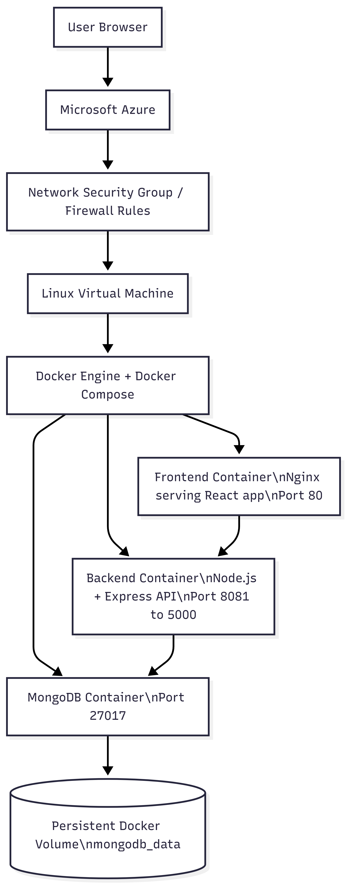

# Project Report 

## 1. Introduction

This project involved designing a private cloud environment and deploying a containerised full-stack web application within that environment. The application in this repository (Midnight Oil) is a three-tier food ordering platform composed of a React frontend, a Node.js/Express backend, and a MongoDB database. The solution was packaged using Docker and orchestrated with Docker Compose to support consistent deployment across development and hosting environments.

This report documents the private cloud plan and design, summarises the implementation process, explains the containerisation strategy, and reflects on the overall outcome of the project. It also identifies the contribution made by each group member and lists the supporting artefacts submitted with the final work.

## 2. Scenario and Objectives

The scenario for this assignment required the developer to design and implement a private cloud solution capable of hosting a containerised application. In response, I selected a web-based restaurant platform that allows users to browse menus and products and submit contact messages. The application was split into separate frontend, backend, and database services to follow a modular architecture suitable for cloud deployment.

The project objectives were as follows:

1. Design a private cloud environment that can host the application reliably.
2. Identify infrastructure, networking, storage, and security requirements.
3. Justify the technologies selected for both the cloud platform and the application stack.
4. Containerise the application components using Docker.
5. Deploy the containerised application in the target environment.
6. Validate that the services communicate correctly and are accessible to users.

## 3. Private Cloud Plan and Design

### 3.1 Requirements Analysis

The solution required an environment capable of hosting three connected services:

1. A frontend web service for user interaction.
2. A backend API service for application logic and data access.
3. A MongoDB database service for persistent storage.

From an infrastructure perspective, the environment needed to provide the following:

1. One virtual machine or node capable of running Docker.
2. Network connectivity between containers and external users.
3. Persistent storage for MongoDB data.
4. Basic security controls for access to the application and management interfaces.
5. Sufficient CPU, RAM, and storage resources to support the application workload.

Functional requirements included:

1. Displaying menu and product data to users.
2. Accepting contact messages from the frontend and storing them in MongoDB.
3. Serving the frontend over HTTP and exposing backend endpoints for data access.

Non-functional requirements included:

1. Portability across environments.
2. Ease of deployment and redeployment.
3. Maintainability through service separation.

### 3.2 Technology Justification

The selected technologies were appropriate for the project because they matched both the technical requirements and the learning objectives of the assignment as well as being widely used in industry.

Docker was used to package each application component into isolated containers. This made deployment more consistent and reduced dependency issues between environments.

Docker Compose was used to define and run the multi-container solution. It allowed the team to describe the frontend, backend, and database services in a single configuration file and manage them together.

MongoDB was selected as the database because the backend uses Mongoose and stores flexible document-based entities such as products, menus, and messages.

Node.js with Express was used for the backend API because it offers lightweight routing, JSON handling, and a straightforward integration with MongoDB.

React with Vite was used for the frontend because it supports component-based development and efficient client-side routing.

Microsoft Azure was selected as the cloud platform for this project because it provided a straightforward way to provision and manage the virtual machine used to host the containerised application.

### 3.3 Proposed Architecture

The application follows a three-tier architecture deployed as separate services:

1. The frontend container serves the React application through Nginx on port 3000 inside the container and is published externally on port 80.
2. The backend container runs the Express API on port 5000 inside the container and is published externally on port 8081.
3. The MongoDB container provides persistent data storage on port 27017 and uses a named volume for database persistence.

The Compose configuration in [docker-compose.yml](docker-compose.yml) defines the service relationships. The backend depends on the database service and uses the internal hostname `db` through the connection string `mongodb://db:27017/projeto_faculdade`. The frontend depends on the backend and communicates with it through the published backend API endpoint.

Architectural diagram for the application layer:

### 3.4 Resource Plan

The resource plan should reflect the capacity needed to run the private cloud platform and the application stack. A suitable plan for this project would include:

1. Compute: enough vCPU and RAM to run the host environment plus the three containers.
2. Storage: operating system storage plus persistent database storage.
3. Network: internal communication between services and controlled external access to the application.

### 3.5 Security Considerations

Security was an important design factor because the solution exposes web services and stores user-submitted data. The following considerations applied to the project:

1. Service isolation through containers reduced direct dependency conflicts between components.
2. MongoDB persistence was isolated into a named volume rather than stored inside ephemeral containers.
3. Only required ports were published externally through Docker Compose.
4. The backend accessed the database through an environment variable rather than hard-coding the connection details in the source logic.
5. Input validation is present in parts of the backend, for example when processing contact messages.

